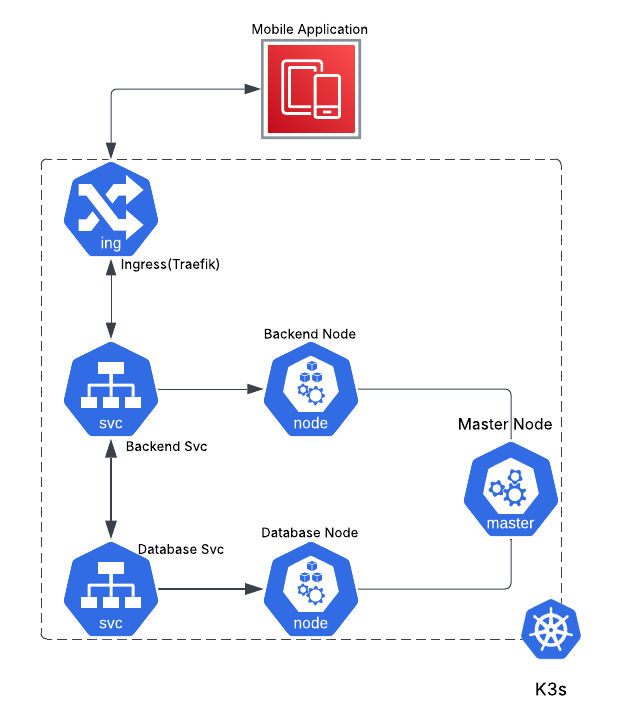
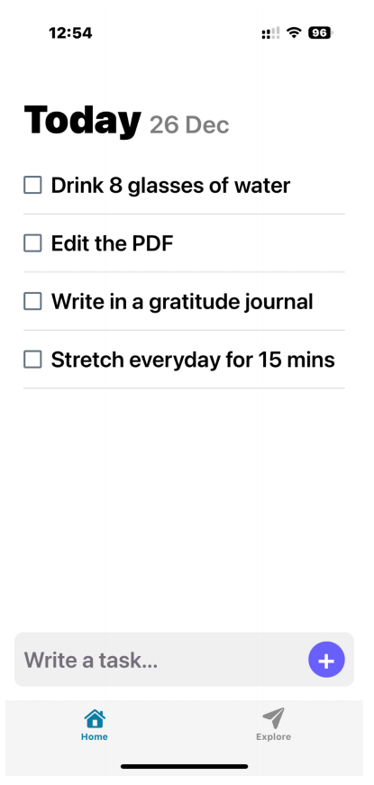
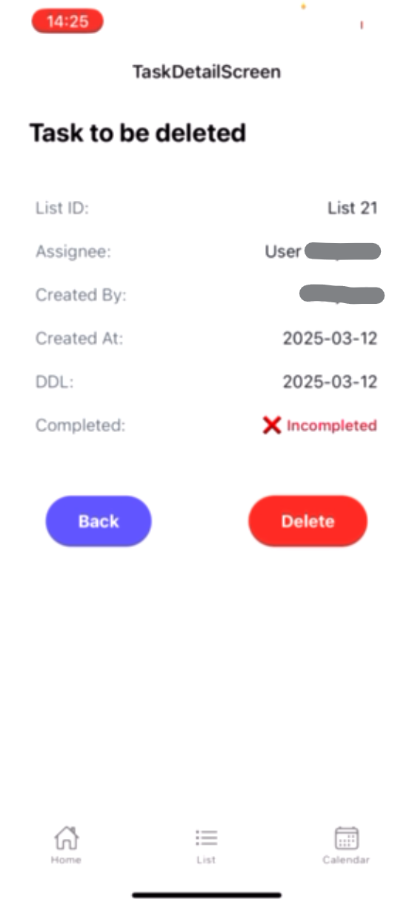
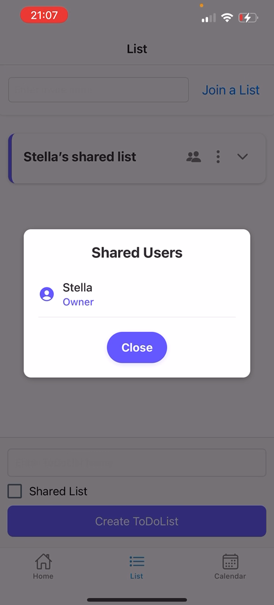
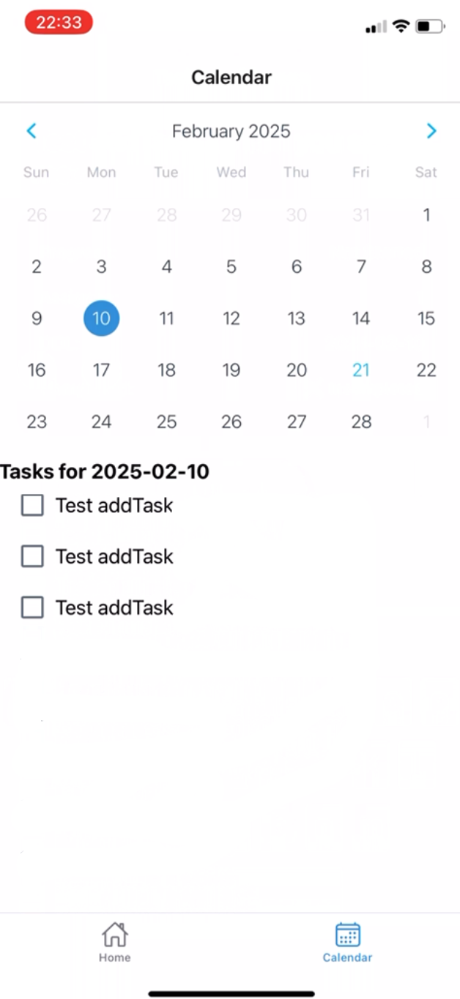

# 🧩 TodoList Platform (FastAPI + React Native)

## 📋 Overview  
A lightweight cross-platform to-do list application that allows users to manage personal and shared tasks. It supports user registration, login, task creation, and shared list collaboration.

## 📐 Architecture  
This project follows a three-tier architecture:

- **Frontend:** React Native app communicates with backend via HTTPS using Axios.
- **Backend:** FastAPI handles API requests, deployed as a Pod inside a K3s cluster.
- **Database:** MySQL Pod inside the same K3s cluster, connected via internal Kubernetes service.

All services were deployed using Docker and K3s, with Traefik as the ingress controller.



## 🚀 Features  
- Cross-platform frontend (iOS, Android, Web via Expo)  
- User registration and login  
- Task creation, update, and viewing  
- Shared task lists between users  
- Persistent login state using Redux-Persist  
- Real-time API communication via Axios  
- Cloud-based backend deployment using K3s

## 🧠 Project Background  
This project was developed as part of the Platform-Spanning Systems course at Uppsala University. Our team worked in agile sprints, writing sprint reports and using Jira to track progress and assign tasks.

## 👩‍💻 My Contributions  
- Designed and implemented the homepage task list UI  
- Implemented frontend registration and login pages  
- Wrote frontend API logic in `taskService.ts` and `authServices.ts`  
- Created backend login/register endpoints using FastAPI  
- Updated task status logic and database integration  
- Helped with K3s worker node deployment and wrote setup documentation
In addition to development work, I also contributed to agile team processes by writing sprint reports and helping manage our Jira board to track user stories and team progress.

## 🧰 Tech Stack  
- **Frontend:** React Native, Expo, Redux, Redux-Persist, Axios  
- **Backend:** FastAPI (Python), MySQL  
- **DevOps:** Docker, K3s, Traefik  
- **Tools:** Postman (API testing), Git, VS Code  

## 🛠 Setup (optional)  
> This project was deployed in a K3s-based environment provided during the course. If the VM is still active, you can follow the steps below to run the system.

### ✅ 1. Clone the project

```bash
git clone https://github.com/jiawen-jasmine-chen/fastapi-task-manager.git
cd TODO
```

✅ 2. Start the frontend (Expo)
Make sure you have Expo CLI installed. If not:

```bash
npm install -g expo-cli
```

Then run the frontend:

```bash
cd frontend
npx expo start
```

This will open the Expo Dev Tools in your browser. You can scan the QR code with the Expo Go app on your phone (iOS/Android), or run it in an emulator.

✅ 3. Backend (optional)
If the backend service is still running on the VM, no additional setup is needed. The frontend will connect to it using the pre-configured API endpoints.

You can update the backend base URL in the API service files (e.g., taskService.ts, authServices.ts) if needed.

💡 Tip
The cloud VM environment used during the course may have been deactivated. If you cannot connect to the backend, it's likely that the deployment has expired. In that case, you can run the backend and database locally with manual setup.


## 📸 Screenshots
Here are some screenshots showing key parts of the system:

### 🏠 Homepage  
Displays all tasks in the selected to-do list.  


---

### 📋 Detailed Task Page  
Shows task details and allows status updates.  


---

### 👥 Shared List Page  
Allows users to access and view shared tasks.  


---

### 📅 Calendar View  
Visualizes tasks by due date using a simple calendar layout.  


## 📌 Design Notes

### 🔄 Frontend Design Tradeoffs
- We initially used **Expo Router**, but later refactored to **React Navigation** due to compatibility issues and limited control over routing behavior.
- **Expo** provided fast setup and great cross-platform support (iOS, Android, Web), but during development, it introduced **delays and caching issues**. We had to manually restart and clear cache frequently to ensure test consistency.
- In hindsight, while the Expo experience slowed us down during testing, its cross-platform capability would be a huge benefit in scaling the app to multiple platforms.

### ⚙️ Backend Technology Choice
- We chose **FastAPI** for its simplicity, async support, and excellent auto-generated documentation.
- While FastAPI is lightweight and productive for small-to-medium apps, it may struggle under **heavy concurrent load** without optimization. For our use case, it was more than sufficient.

### 🧱 Deployment Reflection (K3s)
- Deploying our app in a **K3s cluster** was a valuable learning experience, but K3s is more suitable for lightweight or internal deployments.
- We deployed backend and database as Pods across different nodes. This gave us **modularity**, **internal service discovery**, and a **realistic cloud-like setup**.
- However, the deployment lacked **auto-scaling** and **load balancing**, which could be critical for production-level scaling.

### 🔍 Scalability Considerations
- If user traffic increased significantly, we would need to add **caching (e.g., Redis)**, **load balancing (NGINX/Traefik + replicas)**, and potentially **migrate to full Kubernetes or cloud services**.


## 🔗 License or Links
GitHub repo: https://github.com/jiawen-jasmine-chen/fastapi-task-manager